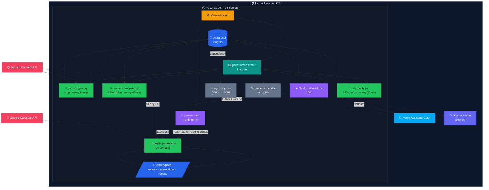

# Pacer — Home Assistant Add-on

> **Fork.** Built on
> [ha-garmin-fitness-coach-addon](https://github.com/askb/ha-garmin-fitness-coach-addon)
> and [ha-garmin-fitness-coach-app](https://github.com/askb/ha-garmin-fitness-coach-app)
> by Anil Belur (Apache-2.0 / MIT), which in turn build on
> [create-t3-turbo](https://github.com/t3-oss/create-t3-turbo) (MIT).
> Renamed to Pacer and maintained as a standalone, self-hosted add-on.
> Attribution and the statement of changes required by Apache-2.0 §4(b) are
> in [NOTICE](NOTICE); the changes themselves are listed in
> [pacer/CHANGELOG.md](pacer/CHANGELOG.md).

AI-powered sport scientist that turns your Garmin data into actionable
coaching, training analysis, and recovery optimization — running entirely on
your local network.

---

## Table of Contents

- [Features](#features)
- [Architecture](#architecture)
- [Installation](#installation)
- [Configuration](#configuration)
- [Garmin Authentication](#garmin-authentication)
- [AI Backend Options](#ai-backend-options)
- [Automation Blueprints & Templates](#automation-blueprints--templates)
- [Garmin Watch Compatibility](#garmin-watch-compatibility)
- [Troubleshooting](#troubleshooting)
- [Development](#development)
- [Contributing](#contributing)
- [Disclaimer](#disclaimer)
- [License](#license)

## Features

- 🏋️ **Training Load Analysis** — CTL / ATL / TSB (Banister fitness-fatigue
  model), ACWR injury-risk tracking (Hulin 2016)
- 📊 **Zone Analytics** — HR zone distribution, Seiler polarization index,
  efficiency trends, calendar heatmap
- 🧠 **AI Specialist Agents** — Sport scientist, psychologist, nutritionist,
  recovery coach (via HA Conversation, local Ollama, or rules-based)
- 🏃 **Race Predictions** — Riegel formula for 5K / 10K / half-marathon /
  marathon
- 💤 **Sleep Coaching** — Sleep debt tracking, bedtime recommendations, quality
  trends, stage analysis
- 📈 **6+ Year Trends** — Long-term multi-metric overlay charts with rolling
  averages and notable-change detection
- 🩺 **Readiness Score** — Evidence-based daily score (0-100) using HRV, sleep,
  training load, and stress (Buchheit 2014)
- 🚨 **Stress Board** — Scores calendar meetings against your heart rate
  (90-min local baseline, ridge regression over attendees) to rank which
  people spike — or calm — your HR; links Google Calendar and merges
  HA-logged out-of-calendar interactions
- 🔒 **Fully Private** — All data stays local; AI runs on your hardware

## Architecture



```text
Startup order:
  postgresql → garmin-auth (parallel) → pacer orchestrator
    → garmin-sync (background loop, waits for tokens)
    → metrics-compute (120s delay, then every 60 min)
    → ha-notify (180s delay, then every 30 min)
    → Next.js standalone server (:3001)
    → ingress-proxy (:3000 → :3001, HA ingress path rewriting)
    → process monitor (restarts dead services every 60s)
```

## Installation

Pacer is installed as a **local add-on**: Home Assistant builds the image on
your own machine from this repository. There is no prebuilt image and no
public add-on store entry.

1. Copy the `pacer/` folder of this repository to `/addons/pacer/` on your
   Home Assistant host. HA expects `config.json` to sit directly beneath the
   add-on folder, so copy `pacer/`, not the repository root. Over SSH:
   ```bash
   rsync -a --delete pacer/ root@<haos-host>:/addons/pacer/
   ```
   The Samba or "Advanced SSH & Web Terminal" add-ons both expose `/addons`.
2. In Home Assistant go to **Settings → Add-ons → Add-on Store → ⋮ → Check
   for updates**. **Pacer** appears under *Local add-ons*.
3. Click **Install**. The first build takes roughly 5 minutes on amd64 and
   10-15 minutes on aarch64, since the Next.js app is compiled from source.
4. Start the add-on — it appears in your sidebar automatically.

To update, re-copy the folder and rebuild from the same screen.

### First-Time Setup

1. **Open the addon** from your HA sidebar (or Settings → Add-ons → Pacer → Open Web UI).
2. **Complete the onboarding wizard** (4 steps):
   - **About You** — age, sex, weight, height
   - **Your Sports** — select sports and goals for each
   - **Weekly Schedule** — training days and session duration
   - **Health & Safety** *(optional)* — health conditions, injuries, medications
3. **Connect Garmin** — go to **Settings → Connect Garmin**, enter your email
   and password. If MFA is enabled, enter the verification code when prompted.
4. **Wait for initial sync** — the first sync pulls your full Garmin history
   (up to 6+ years). This takes **30-45 minutes** due to Garmin API rate
   limits. You can monitor progress in Settings (a progress bar shows sync
   status). Subsequent syncs only pull the last 7 days and take ~30 seconds.
5. **Restart the addon** after the first sync completes to trigger the
   metrics compute and HA sensor push.

> **💡 Tip:** You can trigger a manual sync at any time from
> **Settings → 🔄 Sync Now** without waiting for the next scheduled interval.

## Configuration

| Option | Type | Default | Required | Description |
|---|---|---|---|---|
| `garmin_email` | email | — | No | Your Garmin Connect email (or use web-based login in Settings) |
| `garmin_password` | password | — | No | Your Garmin Connect password (or use web-based login in Settings) |
| `ai_backend` | list | `none` | No | AI coaching backend (`ha_conversation`, `ollama`, `openrouter`, or `none`) |
| `openrouter_api_key` | password | — | No | API key for the `openrouter` backend |
| `openrouter_model` | string | — | No | Model slug for the `openrouter` backend |
| `ollama_url` | url | — | No | Ollama server URL (only when `ai_backend` is `ollama`) |
| `sync_interval_minutes` | integer | `60` | No | How often to pull new data from Garmin (5 – 1440 minutes) |

## Garmin Authentication

Pacer authenticates with Garmin Connect using a **web-based auth flow**:

1. Open the addon **Web UI** (sidebar → Pacer).
2. Navigate to **Settings → Connect Garmin**.
3. Enter your **email** and **password**. If your account has MFA enabled you
   will be prompted for the one-time code during the same flow.
4. On success the addon stores an OAuth session token locally in
   `/data/garmin-tokens/`. No credentials are sent to any third-party service.

> **Token lifetime:** The session token is valid for roughly **one year**
> before Garmin forces a re-authentication.  The addon will surface a
> notification when a token refresh is needed.

## AI Backend Options

| Backend | Description |
|---|---|
| `openrouter` | Calls OpenRouter's chat-completions API directly; supports ZDR (zero-data-retention) and EU-only provider pinning for privacy. |
| `ha_conversation` | Routes prompts through the Home Assistant Conversation API to whatever agent you have configured (e.g., OpenAI, Claude, local LLM). Zero extra setup if you already use one. |
| `ollama` | Direct HTTP connection to a local [Ollama](https://ollama.com/) instance — fully private, runs on your hardware. Set `ollama_url` to the instance address. Also powers coach memory (RAG) via embeddings. |
| `none` **(default)** | Rules-based coaching only — no LLM required. Still provides all data-driven insights, readiness scores, and training-load analytics. |

## HA Sensors

`ha-notify.py` pushes a set of Home Assistant sensors via the Supervisor API, including:

| Entity ID | Description |
|-----------|-------------|
| `sensor.pacer_ctl` | Chronic Training Load (42-day fitness) |
| `sensor.pacer_atl` | Acute Training Load (7-day fatigue) |
| `sensor.pacer_form` | Training Stress Balance (TSB = CTL − ATL) |
| `sensor.pacer_acwr` | Acute:Chronic Workload Ratio (injury risk) |
| `sensor.pacer_injury_risk` | Risk level: Low / Moderate / High / Very High |
| `sensor.pacer_body_battery` | Current Garmin Body Battery value |
| `sensor.pacer_sleep_debt` | Accumulated sleep debt (hours) |
| `sensor.pacer_fitness_age` | VO2max expressed as an age against the HUNT3 reference cohort, with `delta_years` |
| `sensor.pacer_bedtime_target` | Next target bedtime as a timestamp, with `local_time` and `anchor` |
| `sensor.pacer_wake_window` | Wake window as `HH:MM-HH:MM`, with `start` / `end` / `target` |
| `sensor.pacer_data_quality` | Unresolved sync-gap count, with `missing_days_14d` / `stale_days` / `field_gaps` / `status` attributes |

## Automation Blueprints & Templates

### HA Blueprints (importable)

Six ready-to-import Home Assistant blueprints are included in
`pacer/rootfs/app/blueprints/`. Import them via **Settings → Automations
→ Blueprints → Import Blueprint** using the raw GitHub URL:

| Blueprint | Trigger | What It Does |
|-----------|---------|--------------|
| **Low Body Battery Recovery** | Body Battery < threshold | Dims lights, activates recovery scene, sends push notification |
| **Morning Training Briefing** | Configurable time (default 7 AM) | TTS announcement + push with ACWR, form, and workout recommendation |
| **Injury Risk Alert** | Risk level → high or critical | Urgent push notification, optional DND toggle |
| **Training Freshness Reminder** | TSB (form) > threshold | Push notification to train when body is fresh |
| **Weekly Training Summary** | Configurable day/time | Weekly CTL, ATL, TSB, ACWR, risk, body battery summary |
| **Wind-Down Reminder** | Configurable offset before `sensor.pacer_bedtime_target` | Push reminder with tonight's target bedtime and wake window, optional scene + dimmed lights |

All blueprints use configurable inputs (thresholds, notification targets,
scenes) with sensible defaults for Pacer sensor entities. Seven further
ready-to-paste automations (voice ACWR query, sleep-debt management, and
more) live in [`HA_AUTOMATIONS.md`](pacer/HA_AUTOMATIONS.md).

## Testing

The engine unit tests cover the deterministic maths — readiness, strain,
ACWR, CTL/ATL/TSB, VO2max, forecasting and the daily recommendation rules:

```bash
cd pacer/app && pnpm --filter @acme/engine test
```

These matter because readiness scoring and workout recommendation are
implemented twice — in Python for the Home Assistant sensors and in
TypeScript for the web UI — and the `accuracy-reference` spec is what keeps
the two in agreement.

## Garmin Watch Compatibility

Pacer connects to the **Garmin Connect web API** — not directly to your
watch. Any Garmin watch that syncs to Garmin Connect will work, but the depth
of coaching features depends on which sensors your watch has.

### Full Feature Support

Watches with Body Battery, HRV, VO2 Max, and Training Status:

- **Forerunner** 165, 255, 265, 955, 965
- **Fenix** 7, 7X, 8, 8X
- **Epix** (Gen 2), Epix Pro
- **Enduro** 2, 3
- **MARQ** (Gen 2)

All metrics available: training load (CTL/ATL/TSB), ACWR injury-risk, HR zone
polarization, recovery scores, sleep staging, Body Battery trends, HRV status.

### Partial Feature Support

Watches with HR + sleep but limited/no Body Battery or HRV:

- **Vivoactive** 4, 5
- **Venu** 2, 2 Plus, 3, Sq, Sq 2
- **Instinct** 2, 2X, Crossover, Solar

Most coaching works. Body Battery and HRV-based recovery may show as
unavailable. Training load still calculates from HR zones.

### Basic Support

Watches with steps + HR only (no advanced physiology):

- **Vivosmart** 4, 5
- **Vivofit** 4, Jr. 3
- **Lily** (Gen 1, 2)

Steps, heart rate, and sleep duration are available. Advanced training metrics
(VO2 Max, Training Status, Body Battery) will not be populated.

> **Note:** Pacer handles missing data gracefully — sensors for
> unavailable metrics simply show as "Unknown" in Home Assistant.

## Troubleshooting

### Garmin rate limits ("429" / `Login failed`)

Garmin limits OAuth logins but not token refreshes. Once authenticated,
saved tokens in `/data/garmin-tokens/` make every later sync a refresh (not
a login). Problems arise on fresh installs where the addon falls back to
`garmin_email`/`garmin_password` logins.

**Fix:** stop the addon, wait 15–30 minutes (up to 1–2 h if it re-fails),
and start again for one clean login; tokens are then re-saved. Avoid
frequent uninstall/reinstall cycles — a normal reinstall restores the
tokens from `/share/pacer/garmin-tokens/` automatically.

### Empty dashboard after install

First check the **Log** tab. If you see `No Garmin credentials or saved
tokens — skipping auto-sync`, run **Settings → Connect Garmin** to
authenticate. The first sync pulls up to 6+ years of history and takes
**30–45 minutes** (rate-limited); watch progress via **Settings → Sync
Now**. Subsequent syncs take ~30 seconds.

### Garmin MFA / token expiry

MFA codes expire after ~60 seconds — enter them promptly. OAuth tokens
expire after roughly a year; re-authenticate from **Settings → Connect
Garmin**.

## Data Persistence & Backup

All data is stored in PostgreSQL at `/data/postgresql/` and backed up after
every sync and on shutdown.

| Data | Location | Backup |
|---|---|---|
| Daily metrics, activities, VO2max, profile, readiness | PostgreSQL `/data/` | `/share/pacer/pacer.sql.gz` |
| Garmin OAuth tokens | `/data/garmin-tokens/` | `/share/pacer/garmin-tokens/` |

On reinstall with an empty database, Pacer restores the database and tokens
from `/share/pacer/` automatically — no manual step needed.

| Field | Source | Editable? |
|---|---|---|
| Age, sex, weight, height | User input (Settings) | ✅ |
| Goals, weekly schedule | User input (Settings) | ✅ |
| Health conditions, injuries, meds | User input (Health & Safety) | ✅ |
| Resting HR, HRV baselines | Computed from Garmin | ❌ |
| VO2max, lactate threshold | Synced from Garmin API | ❌ |

## Accuracy — How We Compare to Garmin & WHOOP

Every metric uses **published, peer-reviewed formulas** verified by automated
accuracy tests. Stress and HRV are read directly from your Garmin watch —
identical to what Garmin Connect shows.

| Chart | Our Method | vs Garmin / WHOOP |
|-------|-----------|-------------------|
| **Body Stress** | Direct Garmin API (`avgStressLevel`) | **Identical** to Garmin |
| **HRV Trend** | Direct Garmin API | **Identical** to Garmin |
| **Training Strain** | TRIMP → `21×(1-e^(-TRIMP/250))` | ±1–2 pts vs WHOOP |
| **ACWR** | 7d / 28d strain ratio | Hulin et al. (2016) formula |
| **VO2max** | Uth: `15.3 × (maxHR/restHR)` | ±3–5 mL/kg/min vs lab |
| **Race Predictions** | Riegel: `T₂ = T₁ × (D₂/D₁)^1.06` | ±2–5% for trained runners |
| **Readiness** | Weighted z-scores (HRV 35%, sleep 25%, load 20%, RHR 10%, stress 10%) | Trends match; values differ (open formula vs proprietary ML) |
| **Recovery Time** | Strain × base hours, adj. for sleep/HRV/RHR | ±4–8h (simpler model) |
| **Sleep Score** | Duration 40%, efficiency 25%, deep 20%, REM 15% | Similar components, different weights |

**Key takeaways:** Stress & HRV are the exact Garmin numbers; Strain uses the
same 0–21 scale as WHOOP (±1–2); VO2max & Readiness trends match Garmin/WHOOP
but absolute values differ by 5–10%. Every formula is open-source — no black
box. Sources: Banister (1991), Hulin et al. (2016), Uth et al. (2004), Cooper
(1968), Riegel (1981), Hausswirth & Mujika (2013), Hirshkowitz et al. (2015),
Moore (2016).

## Development

This repository is self-contained. The add-on packaging lives in `pacer/`
and the Next.js / tRPC / Drizzle application it serves lives in
`pacer/app/`, built from local source by the Dockerfile. See `CLAUDE.md` for
the layout and architecture notes.

### Prerequisites

- Docker

### Build Locally

```bash
# Build the addon Docker image
./scripts/build-local.sh

# Build and run (accessible at http://localhost:3100)
./scripts/build-local.sh --run

# Remove built images
./scripts/build-local.sh --clean
```

### Run Tests

```bash
# From the repository root
python -m pytest tests/ -v
```

### CI / release

CI runs a multi-stage Docker build (Node.js builder → HA base image) and
pushes multi-arch images (amd64 + aarch64) to GHCR; tagged releases create
GitHub Releases. A release-gate workflow refuses to ship addon images when
the app repo's `main` checks are not green.

## Contributing

Contributions are welcome! Please see [CONTRIBUTING.md](CONTRIBUTING.md) for
repository structure, local development setup, AI backend details, and the
release process.

## Disclaimer

This project is **not affiliated with, endorsed by, or connected to Garmin
Ltd. or any of its subsidiaries**. "Garmin", "Garmin Connect", "Body Battery",
"Training Status", and related trademarks are the property of Garmin Ltd.

Pacer is an independent, community-developed project that reads publicly
available user data from the Garmin Connect API. Use at your own risk.

## License

This project is licensed under the
[Apache License 2.0](https://www.apache.org/licenses/LICENSE-2.0).
See [LICENSE](LICENSE) for the full text.

SPDX-License-Identifier: Apache-2.0
